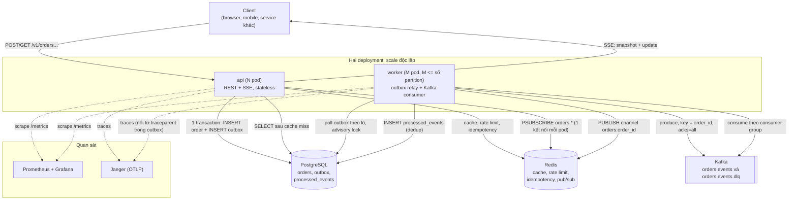
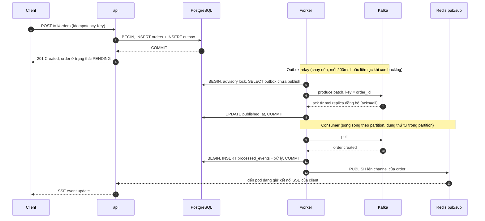
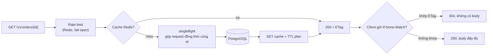
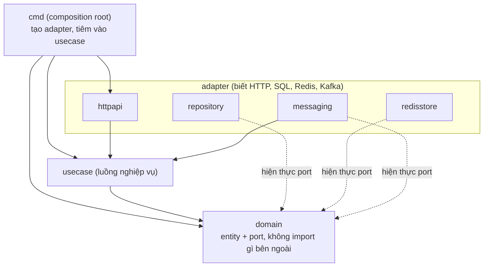

# Go Clean Architecture Template (production grade)

Template backend Go theo Clean Architecture, thiết kế để chịu tải cao và chạy được ở quy mô hàng triệu người dùng.
Đi kèm một domain mẫu hoàn chỉnh (Order) chạy end-to-end, dùng làm khuôn để nhân bản cho các domain khác.

Mọi thành phần trong tài liệu này đã được chạy và kiểm chứng thật: unit test, integration test với Postgres/Redis/Kafka thật, lint, build image, chạy toàn bộ stack bằng Docker Compose và chạy load test k6.

## Có gì bên trong

| Mảng | Giải pháp | Vì sao |
|------|-----------|--------|
| HTTP | `net/http` + `chi` | Chuẩn thư viện, ít magic, dễ test, tương thích hệ sinh thái (otelhttp, middleware) |
| Database | PostgreSQL, `pgx` pool, `sqlc` | SQL kiểm tra kiểu lúc compile, không ORM, hiệu năng gần driver thuần |
| Cache | Redis cache-aside + `singleflight` + circuit breaker | Chống cache stampede, Redis chết thì app vẫn chạy |
| Message queue | Kafka (`franz-go`) | Throughput cao, giữ thứ tự theo key, replay được |
| Độ tin cậy sự kiện | Transactional Outbox + consumer idempotent + DLQ | Không mất và không xử lý trùng sự kiện |
| Pub/Sub realtime | Redis pub/sub + SSE | Đẩy trạng thái realtime tới client ở bất kỳ replica nào |
| Rate limit | Token bucket phân tán (Lua trên Redis) | Giới hạn chung cho mọi replica, fail open |
| Idempotency | Header `Idempotency-Key` | Client retry POST an toàn |
| Logging | `log/slog` JSON, kèm `request_id`, `trace_id` | Tương quan log, trace, request |
| Metrics | Prometheus (RED, DB pool, cache, outbox, consumer, Kafka client) | Quan sát được độ bão hòa |
| Tracing | OpenTelemetry (OTLP), trace đi xuyên qua Kafka | Theo dõi một request qua API, outbox, worker |
| Lint | golangci-lint v2, kể cả `depguard` bảo vệ kiến trúc | Vi phạm lớp bị chặn ngay lúc lint |
| CI/CD | GitHub Actions: lint, test, integration, vuln, docker, Trivy, release, cosign, deploy | Từ commit tới production có kiểm soát |
| Hạ tầng | Dockerfile distroless non-root, Compose, manifest Kubernetes (HPA, PDB, probes) | Chạy được ngay, đúng chuẩn production |

## Kiến trúc và giao tiếp giữa các service

### Tổng quan hệ thống

Template tách thành hai dịch vụ scale độc lập: `api` xử lý request đồng bộ, `worker` gánh phần bất đồng bộ.
PostgreSQL là nguồn sự thật duy nhất, Redis đảm nhận các vai trò phụ (cache, rate limit, idempotency, realtime), Kafka là xương sống sự kiện.



Những điểm chính cần nhớ:

- API không nói chuyện trực tiếp với Kafka.
- Nó chỉ ghi vào Postgres, sự kiện nằm trong bảng outbox và relay mới publish, nhờ đó không mất event khi process chết giữa chừng.
- Worker đóng hai vai: relay đưa outbox lên Kafka, và consumer xử lý sự kiện từ Kafka.
- SSE tới client ở bất kỳ replica nào: worker publish vào Redis pub/sub, mỗi pod api giữ đúng một subscription rồi phân phối cục bộ trong bộ nhớ.
- Trace liền mạch: `traceparent` được lưu trong outbox, đi qua Kafka header, consumer nối tiếp trace.
- Kafka chết không làm sập API: sự kiện nằm chờ trong outbox và tự xả khi Kafka hồi phục.

### Luồng ghi: một order đi qua đâu



Bảo đảm tin cậy của luồng này: at-least-once từ outbox tới Kafka (relay chết sau publish nhưng trước khi đánh dấu thì batch được gửi lại), và exactly-once về hiệu ứng nhờ claim trong `processed_events` cùng transaction với phần xử lý.
Message lỗi retry hết lần sẽ vào topic DLQ kèm thông tin chẩn đoán, không chặn partition.

### Luồng đọc: cache-aside có bảo vệ



Redis lỗi ở luồng này chỉ làm chậm hơn (đọc thẳng DB), không làm request thất bại.
Circuit breaker mở sau vài lỗi liên tiếp để bỏ qua Redis tạm thời.

### Bên trong một service: các lớp Clean Architecture

Quy tắc duy nhất: phụ thuộc chỉ hướng vào trong, và quy tắc này được `depguard` cưỡng chế lúc lint.



Chi tiết từng quyết định, bảng port và adapter, cùng hướng dẫn thêm tính năng mới nằm trong [docs/ARCHITECTURE.md](docs/ARCHITECTURE.md).

## Chạy thử trong 3 lệnh

Yêu cầu: Go (xem `go.mod`), Docker.

```bash
make up          # Postgres, Redis, Kafka, Jaeger, Prometheus, Grafana, rồi migrate, api, worker
curl -s -X POST localhost:8080/v1/orders \
  -H 'Content-Type: application/json' -H 'Idempotency-Key: demo-1' \
  -d '{"customer_id":"0197a1b2-c3d4-7e5f-8a9b-0c1d2e3f4a5b","currency":"USD","items":[{"sku":"A1","quantity":2,"unit_price":1500}]}'
make down        # dừng và xóa dữ liệu
```

Giao diện quan sát khi `make up` đang chạy:

| Công cụ | Địa chỉ |
|---------|---------|
| API | http://localhost:8080 |
| Metrics / readiness của api | http://localhost:9090/metrics , `/readyz` |
| Grafana (dashboard "service overview") | http://localhost:3000 |
| Jaeger (trace) | http://localhost:16686 |
| Prometheus | http://localhost:9099 |

Chạy api và worker bằng `go run` để lặp nhanh khi phát triển:

```bash
make infra-up       # chỉ chạy các dịch vụ nền
make migrate-up
make run-api        # terminal 1
make run-worker     # terminal 2
```

## API mẫu

| Method | Path | Mô tả |
|--------|------|-------|
| POST | `/v1/orders` | Tạo order. Hỗ trợ `Idempotency-Key`. Trả `201` kèm `Location` |
| GET | `/v1/orders/{id}` | Lấy order. Có `ETag`, hỗ trợ `If-None-Match` trả `304` |
| GET | `/v1/orders?customer_id=...&limit=20&cursor=...` | Danh sách phân trang keyset, mới nhất trước |
| POST | `/v1/orders/{id}/cancel` | Hủy order đang `PENDING` |
| GET | `/v1/orders/{id}/stream` | SSE realtime: sự kiện `snapshot` rồi `update` |

Lỗi trả về theo chuẩn RFC 9457 (`application/problem+json`), luôn có `request_id`.

Xem realtime: mở `curl -N localhost:8080/v1/orders/<id>/stream` ở một terminal, rồi hủy order ở terminal khác.

## Cấu trúc thư mục

```
cmd/
  api/        Composition root của HTTP API (stateless, scale theo request rate)
  worker/     Outbox relay + Kafka consumer (scale theo consumer lag)
  migrate/    Chạy migration (nhúng sẵn SQL, dùng như Kubernetes Job)
internal/
  domain/     Entity, quy tắc nghiệp vụ, lỗi domain, các port (interface). Không phụ thuộc gì bên ngoài
  usecase/    Luồng nghiệp vụ ứng dụng, chỉ nói chuyện qua port của domain
  adapter/
    httpapi/      Router, middleware, DTO, handler, SSE
    repository/   pgx + sqlc, transaction manager, outbox store
    redisstore/   Cache, rate limiter, idempotency store, pub/sub hub
    messaging/    Kafka producer, outbox relay, consumer, retry và DLQ
  platform/   Hạ tầng dùng chung: config, logger, database, redis, kafka, telemetry, metrics, health, httpserver
  integration/  Integration test (build tag `integration`, testcontainers)
db/           migrations/ và queries/ (nguồn của sqlc)
deploy/       Dockerfile, docker-compose, k8s/, observability/
docs/         Tài liệu chi tiết và ADR
test/load/    Kịch bản k6
```

## Đọc tiếp

| Tài liệu | Nội dung |
|----------|----------|
| [docs/ARCHITECTURE.md](docs/ARCHITECTURE.md) | Kiến trúc, luồng dữ liệu, giải thích từng quyết định, cách thêm tính năng mới |
| [docs/SCALING.md](docs/SCALING.md) | Cách đạt quy mô triệu người dùng: tính toán dung lượng, từng bước mở rộng, tối ưu hiệu năng |
| [docs/RUNBOOK.md](docs/RUNBOOK.md) | Vận hành: cảnh báo, xử lý sự cố, deploy, rollback, migration |
| [docs/adr/](docs/adr/) | Các quyết định kiến trúc (ADR) và lý do |

## Lệnh thường dùng

Chạy `make help` để xem đầy đủ.

| Lệnh | Tác dụng |
|------|----------|
| `make check` | Mọi thứ CI kiểm tra: tidy, format, lint, test |
| `make test` / `make test-integration` | Unit test với `-race` / integration test bằng Docker |
| `make lint` / `make fmt` / `make vuln` | Lint, format, quét lỗ hổng |
| `make sqlc` | Sinh lại code truy vấn từ `db/queries` |
| `make migrate-new name=add_foo` | Tạo cặp migration mới |
| `make load-test` | Load test k6 |

Các công cụ (golangci-lint, sqlc, govulncheck) được pin phiên bản trong Makefile và chạy qua `go run`, không cần cài global.

## Dùng template cho dự án của bạn

```bash
./scripts/rename.sh github.com/acme/billing-service
make check
```

Script đổi module path, tên image và tên service trong toàn bộ file.
Sau đó thêm domain mới theo checklist trong [docs/ARCHITECTURE.md](docs/ARCHITECTURE.md#8-thêm-một-tính-năng-mới).

## Cấu hình

Toàn bộ cấu hình qua biến môi trường (12-factor), mô tả ở `internal/platform/config/config.go`, mẫu ở `.env.example`.
Các biến quan trọng nhất:

| Biến | Mặc định | Ý nghĩa |
|------|----------|---------|
| `DB_URL` | bắt buộc | Chuỗi kết nối PostgreSQL |
| `DB_MAX_CONNS` | 25 | Tổng `replicas x DB_MAX_CONNS` phải nhỏ hơn `max_connections` của Postgres |
| `REDIS_ADDR` | localhost:6379 | Redis |
| `KAFKA_BROKERS` | localhost:9092 | Danh sách broker, phân tách bằng dấu phẩy |
| `RATE_LIMIT_RPS` / `RATE_LIMIT_BURST` | 100 / 200 | Giới hạn mỗi IP |
| `HTTP_REQUEST_TIMEOUT` | 10s | Timeout mỗi request |
| `HTTP_SHUTDOWN_DELAY` | 3s | Thời gian drain sau SIGTERM trước khi đóng listener |
| `OTEL_EXPORTER_OTLP_ENDPOINT` | rỗng | Rỗng nghĩa là không export trace |
| `OTEL_TRACE_SAMPLE_RATIO` | 0.1 | Tỉ lệ lấy mẫu trace |

## Những điều phải làm trước khi lên production thật

Template này cố ý không bao gồm các mục sau vì chúng phụ thuộc vào hệ thống của bạn.
Hãy xử lý từng mục và đừng bỏ qua.

1. **Xác thực và phân quyền.** `customer_id` hiện do client gửi lên và được tin tưởng. Phải thay bằng danh tính lấy từ token (JWT/OIDC) trong middleware, và scope `Idempotency-Key` theo người dùng (đã đánh dấu `TODO(auth)` trong code).
2. **TLS và edge.** Kết thúc TLS, WAF, giới hạn tốc độ tầng biên ở ingress hoặc CDN. Bật `HTTP_TRUST_PROXY_HEADERS=true` chỉ khi đứng sau proxy tin cậy.
3. **Secret.** Dùng External Secrets, Sealed Secrets hoặc Vault. Không commit `secret.example.yaml` với giá trị thật.
4. **PostgreSQL HA.** Primary với replica và failover tự động, backup liên tục (PITR), thử restore định kỳ. Đặt PgBouncer phía trước khi tổng số kết nối tăng.
5. **Kafka.** Replication factor 3, `min.insync.replicas=2`, tạo topic bằng IaC. Compose chỉ dùng RF 1 cho máy dev.
6. **Alert routing.** `deploy/observability/alerts.yml` chỉ định nghĩa luật, bạn cần nối tới Alertmanager, PagerDuty hoặc Slack.
7. **Giới hạn đã biết.** Xem mục "Giới hạn và đánh đổi" trong [docs/ARCHITECTURE.md](docs/ARCHITECTURE.md#10-giới-hạn-và-đánh-đổi).
