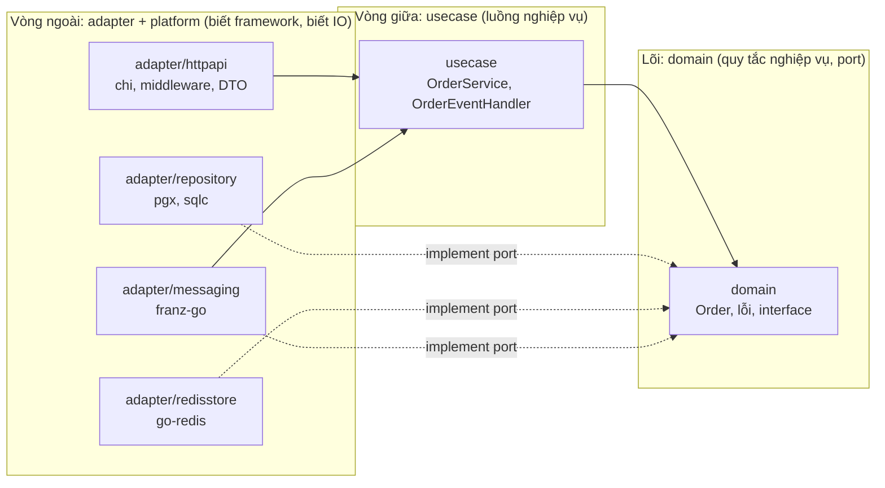
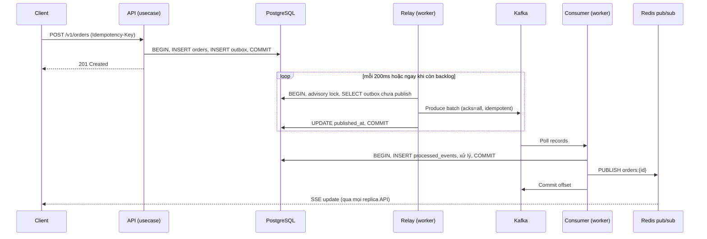

# Kiến trúc

Tài liệu này giải thích template được tổ chức như thế nào, dữ liệu chảy ra sao và vì sao từng quyết định được đưa ra.
Mỗi quyết định lớn có một ADR riêng trong [docs/adr](adr/).

## 1. Clean Architecture trong Go

Clean Architecture chia code thành các vòng tròn đồng tâm.
Quy tắc duy nhất cần nhớ là **quy tắc phụ thuộc**: code ở vòng ngoài được phép import vòng trong, không bao giờ ngược lại.

| Lớp | Thư mục | Được biết | Không được biết |
|-----|---------|-----------|-----------------|
| Domain | `internal/domain` | Chỉ thư viện chuẩn và `uuid` | HTTP, SQL, Redis, Kafka, usecase |
| Use case | `internal/usecase` | Domain | Mọi adapter, mọi framework, `net/http` |
| Adapter | `internal/adapter/*` | Domain, usecase, platform | Adapter khác (trừ ngoại lệ ghi bên dưới) |
| Platform | `internal/platform/*` | Thư viện hạ tầng | Domain, usecase |
| Composition root | `cmd/*` | Tất cả | Không chứa logic |

**Quy tắc này được cưỡng chế bằng máy**, không dựa vào kỷ luật.
Rule `depguard` trong `.golangci.yml` làm `make lint` và CI thất bại nếu domain import `pgx`, hoặc usecase import một adapter.
Điều này đã được kiểm chứng bằng cách cố tình thêm import sai: lint báo lỗi đúng chỗ.

Ngoại lệ có chủ đích: `redisstore.Idempotency` import các kiểu `httpapi.IdemResult`, `httpapi.SavedResponse` vì hợp đồng idempotency là một khái niệm của lớp HTTP.
Chiều ngược lại không xảy ra, `httpapi` không bao giờ import `redisstore`.

### Port và adapter

Port là interface do lớp trong định nghĩa, ở `internal/domain/ports.go`.
Adapter là bản cài đặt ở vòng ngoài.

| Port (domain) | Adapter | Công nghệ |
|---------------|---------|-----------|
| `OrderRepository` | `repository.OrderRepository` | pgx + sqlc |
| `TxManager` | `repository.Store` | pgx transaction trong `context` |
| `OutboxWriter`, `OutboxStore` | `repository.Outbox` | Postgres |
| `EventClaimer` | `repository.ProcessedEvents` | Postgres |
| `OrderCache` | `redisstore.OrderCache` | Redis |
| `Realtime` | `redisstore.Realtime` | Redis pub/sub |

Lợi ích thực tế: unit test của `usecase` chạy với fake trong bộ nhớ, không cần Docker, mất vài mili giây.
Đổi Redis sang Memcached hay Postgres sang một cơ sở dữ liệu khác chỉ cần viết adapter mới, usecase và domain không đổi.

## 2. Các binary

| Binary | Vai trò | Stateless | Scale theo |
|--------|---------|-----------|------------|
| `cmd/api` | REST API, SSE | Có | CPU / request rate |
| `cmd/worker` | Outbox relay + Kafka consumer | Có | Consumer lag, tối đa bằng số partition |
| `cmd/migrate` | Áp migration | Không (chạy một lần) | Không |

Tách `api` và `worker` là quyết định có chủ đích.
Một đợt tăng đột biến ở queue không làm chậm API, và một request spike không làm consumer đói CPU.
Hai thứ này cần chính sách scale khác nhau nên không đặt chung một process.

Mỗi `main.go` là **composition root**: nơi duy nhất biết mọi kiểu cụ thể, tạo adapter, tiêm vào usecase rồi chạy server.
Không có biến global, không có `init()` làm việc nặng, nên mọi thứ test được và thứ tự khởi tạo rõ ràng.

## 3. Luồng ghi: Transactional Outbox

Bài toán: tạo order trong Postgres **và** báo cho các hệ thống khác qua Kafka.
Cách ngây thơ "ghi DB rồi publish Kafka" (dual write) luôn có cửa sổ lỗi: DB commit xong nhưng process chết trước khi publish, event mất vĩnh viễn.
Đảo thứ tự thì có event cho một giao dịch đã rollback.

Giải pháp: ghi event vào bảng `outbox` **trong cùng transaction** với dữ liệu nghiệp vụ.
Một relay riêng chuyển các dòng outbox lên Kafka.

Các bảo đảm và cách đạt được:

| Bảo đảm | Cơ chế |
|---------|--------|
| Không mất event | Event nằm trong transaction của dữ liệu nghiệp vụ |
| Không có event cho giao dịch rollback | Cùng transaction, rollback xóa cả hai |
| At-least-once tới Kafka | Relay chỉ đánh dấu `published_at` sau khi broker ack toàn bộ batch. Chết giữa chừng thì batch được gửi lại |
| Thứ tự theo aggregate | Key Kafka là `aggregate_id`, cùng key luôn cùng partition. Relay chạy một instance tại một thời điểm nên không đảo thứ tự |
| Exactly-once về hiệu ứng | Consumer ghi `(consumer, event_id)` vào `processed_events` trong cùng transaction với hiệu ứng. Trùng thì bỏ qua |
| Trace liên tục | `traceparent` được lưu vào cột `headers` của outbox, đi qua Kafka header, consumer nối tiếp trace |

Điều kiện: hàm `OutboxWriter.Append` phải được gọi **bên trong** `TxManager.WithinTx`.
Nếu gọi ngoài transaction thì mô hình bị phá vỡ.
Integration test `TestOutboxIsAtomicWithBusinessWrite` kiểm chứng điều này với Postgres thật.

### Chọn một relay hoạt động

Nếu nhiều relay chạy song song và cùng lấy các dòng khác nhau (`SKIP LOCKED`), event của cùng một aggregate có thể bị đảo thứ tự giữa các batch.
Template chọn đảm bảo thứ tự: mỗi batch chạy dưới `pg_try_advisory_xact_lock`, nên chỉ một relay làm việc tại một thời điểm, các relay còn lại ở chế độ chờ nóng (hot standby) và tự thay thế khi relay chính chết.
Một relay đơn đã đủ cho hàng chục nghìn event mỗi giây nhờ xử lý theo lô.
Khi cần hơn nữa, xem mục "Outbox ở quy mô lớn" trong [SCALING.md](SCALING.md).

## 4. Luồng đọc: cache-aside có bảo vệ

`GET /v1/orders/{id}` đi qua các bước:

1. Middleware: request id, metrics, panic recovery, security header, giới hạn body, timeout, rate limit.
2. `OrderService.Get` hỏi Redis trước.
3. Cache miss: các request đồng thời cho cùng một id được gộp thành **một** truy vấn DB bằng `singleflight`.
4. Kết quả được ghi lại vào Redis với TTL cộng thêm jitter ngẫu nhiên.
5. Phản hồi có `ETag` dựa trên `version`. Client gửi `If-None-Match` sẽ nhận `304` không có body.

Bảo vệ khỏi các lỗi kinh điển:

| Vấn đề | Biện pháp |
|--------|-----------|
| Cache stampede (hàng nghìn request cùng miss một key nóng) | `singleflight` gộp thành một lần đọc DB |
| Tất cả key hết hạn cùng lúc | TTL cộng jitter tới 10% |
| Redis chậm làm mọi request chậm | Timeout 300ms, và circuit breaker mở sau 5 lỗi liên tiếp rồi bỏ qua Redis trong 10 giây |
| Đọc dữ liệu cũ sau khi cập nhật | Xóa cache **sau khi commit**. Xóa trước commit cho phép reader nạp lại giá trị cũ |
| Redis chết | Mọi lỗi cache đều thoái hóa thành đọc DB, request không thất bại |

## 5. Chính sách khi có sự cố (fail open hay fail closed)

Đây là quyết định thiết kế quan trọng, được viết rõ để không ai phải đoán lúc 3 giờ sáng.

| Sự cố | Hành vi | Lý do |
|-------|---------|-------|
| Redis chết, cache | Fail open: đọc DB | Cache chỉ là tối ưu |
| Redis chết, rate limit | Fail open: cho qua | Rate limit bảo vệ dung lượng, không được là nguyên nhân gây sập |
| Redis chết, request có `Idempotency-Key` | Fail closed: trả `503` | Client đã yêu cầu bảo đảm không trùng. Bỏ qua một cách im lặng sẽ vi phạm lời hứa |
| Redis chết, `/readyz` | Báo `degraded`, không kéo pod ra khỏi load balancer | Nếu không, một lỗi Redis loại cả đội pod cùng lúc và biến suy giảm thành sập hoàn toàn |
| Postgres chết | `/readyz` trả `503`, pod rời load balancer | Dữ liệu là bắt buộc |
| Kafka chết | API vẫn nhận ghi, event nằm trong outbox, relay thử lại với backoff. Backlog tự xả khi Kafka về | Đây chính là mục đích của outbox |
| Worker chết giữa chừng | Offset chưa commit nên bản ghi được giao lại. Idempotency chặn hiệu ứng trùng | At-least-once cộng dedup |
| Message độc (poison) | Đi thẳng tới DLQ kèm thông tin chẩn đoán, partition không bị chặn | Một message hỏng không được dừng cả luồng |
| DLQ cũng chết | Consumer thử lại vô hạn và tạm dừng partition | Mất message nghiêm trọng hơn tạm dừng |
| Client chậm đọc SSE | Bỏ bớt message của client đó, không chặn client khác | Client sẽ nhận update kế tiếp |
| Panic trong handler | Bắt lại, trả `500`, ghi stack | Một request lỗi không làm sập process |
| SIGTERM | `/readyz` chuyển `503`, chờ `HTTP_SHUTDOWN_DELAY`, rồi drain request đang chạy | Không rớt request khi rolling update |

## 6. Idempotency của POST

Mạng không đáng tin: client timeout rồi gửi lại, và không biết request đầu đã chạy chưa.
Với header `Idempotency-Key`:

| Tình huống | Kết quả |
|------------|---------|
| Key mới | Chạy handler, lưu phản hồi (trừ khi `5xx`) |
| Cùng key, cùng payload, đã xong | Phát lại đúng phản hồi cũ, kèm `Idempotent-Replayed: true`. Handler không chạy lần hai |
| Cùng key, request đầu còn đang chạy | `409` kèm `Retry-After: 1` |
| Cùng key, payload khác | `422`, đây là lỗi của client |
| Kết quả `5xx` | Không lưu, client thử lại sẽ thực sự chạy lại |
| Handler panic | Khóa được giải phóng bằng `defer`, không bị kẹt |

Payload được so sánh bằng SHA-256 của `method + path + body`.
Khóa trong Redis có TTL (mặc định 24 giờ), khóa "đang xử lý" tự hết hạn sau 60 giây nếu process chết.

## 7. Quan sát

| Tín hiệu | Cách làm | Dùng để |
|----------|----------|---------|
| Log | `slog` JSON, mỗi dòng có `service`, `env`, `request_id`, `trace_id`, `span_id` | Tìm mọi log của một request, nhảy từ log sang trace |
| Metric | Prometheus: `app_http_*`, `app_db_pool_*`, `app_cache_operations_total`, `app_outbox_*`, `app_consumer_messages_total`, metric client Kafka | RED, độ bão hòa, cảnh báo |
| Trace | OpenTelemetry OTLP. Tên span là route pattern (độ đa dạng thấp). Trace đi từ API qua outbox và Kafka tới worker | Phân tích độ trễ end-to-end |
| Profiling | `pprof` trên `127.0.0.1:6060`, truy cập bằng `kubectl port-forward` | CPU, heap, goroutine |
| Health | `/healthz` (liveness, không kiểm tra dependency), `/readyz` (readiness) | Kubernetes |

Cổng vận hành (`:9090`) tách khỏi cổng public (`:8080`), không đưa ra ingress.

Về nhãn metric: `route` dùng pattern (`/v1/orders/{id}`), không dùng đường dẫn thật, để tránh bùng nổ cardinality làm Prometheus quá tải.

Ghi chú thực nghiệm về log: access log được ghi đồng bộ ra stdout.
Ở lưu lượng cao hãy giảm mức log (`LOG_LEVEL=warn`) hoặc lấy mẫu access log, và dùng log agent cấp node để đệm.

## 8. Thêm một tính năng mới

Ví dụ thêm domain `Payment`. Làm theo thứ tự từ trong ra ngoài.

1. **Domain** (`internal/domain/payment.go`): entity, hàm khởi tạo có validate, phương thức chuyển trạng thái, lỗi. Thêm port vào `ports.go`. Viết unit test bảng (table-driven).
2. **Migration**: `make migrate-new name=add_payments`, viết cả `up` và `down`. Giữ tương thích ngược (xem RUNBOOK).
3. **SQL**: thêm `db/queries/payments.sql`, chạy `make sqlc`.
4. **Repository**: `internal/adapter/repository/payment.go`, implement port, dùng `store.queries(ctx)` để tự tham gia transaction hiện tại.
5. **Use case** (`internal/usecase/payment.go`): nhận port qua constructor. Nếu cần phát event, gọi `outbox.Append` trong `tx.WithinTx`. Viết unit test với fake.
6. **HTTP**: DTO trong `dto.go`, handler, route trong `router.go`. Ánh xạ lỗi domain đã có sẵn trong `errors.go`.
7. **Wiring**: tạo và tiêm trong `cmd/api/main.go` (và `cmd/worker/main.go` nếu có consumer).
8. **Integration test** trong `internal/integration` cho phần SQL và luồng event.
9. `make check` và `make test-integration`.

Nếu thêm loại event mới: chỉ **thêm** trường vào payload, không đổi tên hoặc xóa, vì consumer cũ vẫn đang chạy.
Loại event lạ được consumer bỏ qua để tương thích tiến.

## 9. Quy ước

| Chủ đề | Quy ước |
|--------|---------|
| Tiền | Số nguyên theo đơn vị nhỏ nhất (cent), không dùng float |
| ID | UUIDv7 (sắp xếp theo thời gian, chèn B-tree gần như append-only, ít phân mảnh index) |
| Thời gian | Luôn UTC trong domain và API |
| Phân trang | Keyset (`created_at, id`), không dùng OFFSET. Chi phí O(trang) dù đi sâu tới đâu |
| Đồng thời | Optimistic locking bằng cột `version`. Xung đột trả `409` |
| Lỗi | Domain error sentinel, bọc bằng `%w`, ánh xạ sang HTTP ở biên. Lỗi lạ trả `500` chung chung, chi tiết chỉ nằm trong log |
| Context | Mọi hàm IO nhận `ctx` đầu tiên. Rollback và bookkeeping cuối request dùng context tách rời (`WithoutCancel`) để vẫn hoàn tất khi client ngắt |
| Test | Unit: fake qua interface, table-driven, `-race`. Integration: thành phần thật qua testcontainers |

## 10. Giới hạn và đánh đổi

Nói thẳng những gì template chưa làm, để bạn quyết định.

| Giới hạn | Tác động | Hướng xử lý |
|----------|----------|-------------|
| Chưa có xác thực | `customer_id` do client gửi | Thêm middleware JWT/OIDC, lấy danh tính từ token |
| Một domain mẫu | Chưa có ví dụ quan hệ nhiều bảng hay saga | Nhân bản theo checklist ở mục 8 |
| Replay response không kèm header `Location` | Chỉ phát lại status, content-type, body | Lưu thêm header nếu client cần |
| Relay đơn (một hoạt động tại một thời điểm) | Trần thông lượng của một relay | Phân mảnh outbox, xem SCALING.md |
| SSE giữ kết nối trên API | Mỗi kết nối tốn một goroutine và một socket | Tách thành dịch vụ gateway riêng khi vượt hàng trăm nghìn kết nối |
| Xóa outbox bằng `DELETE` theo retention | Ở khối lượng rất lớn gây bloat | Phân vùng bảng theo thời gian và `DROP PARTITION` |
| Payload event lưu `jsonb` | Postgres chuẩn hóa thứ tự khóa và khoảng trắng | Dùng cột `json` hoặc `bytea` nếu cần giữ nguyên byte |
| Số liệu hiệu năng trong repo đo trên laptop | Chỉ mang tính tham khảo | Đo lại trên hạ tầng thật, xem SCALING.md |
